# FindGT — ανιχνευτής ανωμαλιών συμμετοχής ομάδων για Golden Ticket

> Εκδόσεις README ανά γλώσσα:
>
> | Γλώσσα  | Αρχείο                       |
> | ------- | ---------------------------- |
> | English | [README.md](README.md)       |
> | Russian | [README.ru.md](README.ru.md) |
> | Greek   | [README.el.md](README.el.md) |
>
> Όλα τα README σε όλες τις γλώσσες πρέπει να έχουν ισοδύναμο νόημα — δείτε [AGENTS.md](AGENTS.md).

Το FindGT εξετάζει τις **Kerberos logon sessions** στα Windows και συγκρίνει τη συμμετοχή ομάδων
**που δηλώνεται από το token κάθε session** με τη **θεμελιωμένη (authoritative) συμμετοχή** που
επιστρέφει ο domain controller για τον ίδιο χρήστη. Ένα Golden Ticket πλαστογραφεί TGT με αυθαίρετα
SID ομάδων (π.χ. `Domain Admins`, `Enterprise Admins`, `Schema Admins`). Αυτές οι πλαστές ομάδες
φαίνονται στο token του session αλλά **όχι** στην authoritative πηγή — αυτό ακριβώς επισημαίνει
το FindGT.

> Ερευνητικό / PoC εργαλείο. Μεγάλο μέρος του κώδικα token/session βασίζεται στο
> [GhostPack/Koh](https://github.com/GhostPack/Koh).

## Γιατί τα hosts εμπιστεύονται ένα Golden Ticket

Στο Kerberos, η εμπιστοσύνη βασίζεται στην έγκυρη κρυπτογραφία και στα service tickets που εκδίδει ο KDC.

1. Ο επιτιθέμενος πλαστογραφεί TGT (Golden Ticket) και εισάγει ψεύτικη συμμετοχή ομάδων στο PAC.
2. Στέλνει αυτό το TGT στον KDC σε TGS request για υπηρεσία-στόχο.
3. Ο KDC ελέγχει την κρυπτογραφική εγκυρότητα του ticket (αλυσίδα εμπιστοσύνης KRBTGT).
4. Αν η κρυπτογραφία είναι έγκυρη, ο KDC εκδίδει service ticket και μεταφέρει PAC authorization data από το εισερχόμενο TGT χωρίς ανακατασκευή του group membership από το AD σε αυτό το στάδιο TGS.
5. Ο επιτιθέμενος παρουσιάζει το service ticket στο host-θύμα.
6. Στο host, το LSASS ελέγχει την κρυπτογραφία του service ticket.
7. Το LSASS υλοποιεί identity/group data στο token του logon session.
8. Η πλαστή συμμετοχή φτάνει στο host ως «έγκυρο» authorization artifact.
9. Το βλέπουμε στα token groups του νέου session.

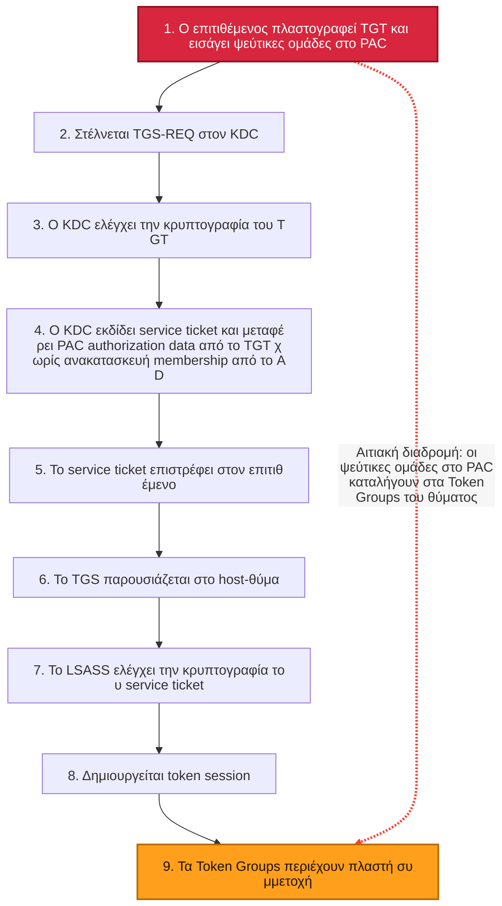

Static SVG: [SlidesAndDocs/diagrams/golden-ticket-trust-flow.svg](SlidesAndDocs/diagrams/golden-ticket-trust-flow.svg)

## Όριο ανίχνευσης: παρατηρήσιμο vs κρυπτογραφημένο

Το FindGT ελέγχει LSASS sessions και token groups επειδή αυτό είναι το πρακτικό, παρατηρήσιμο
και ασφαλέστερο επίπεδο ανίχνευσης σε endpoint.

- Παρατηρήσιμο: logon sessions, token groups, SID diffs.
- Μη πρακτικό σε μεγάλη κλίμακα σε endpoint: αυθαίρετη αποκρυπτογράφηση tickets.
- Λόγος ασφάλειας: τέτοια προσέγγιση αυξάνει την έκθεση key material και την επιφάνεια επίθεσης.

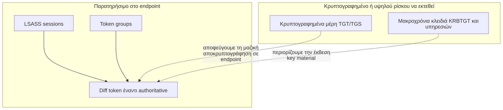

Static SVG: [SlidesAndDocs/diagrams/findgt-observable-boundary.svg](SlidesAndDocs/diagrams/findgt-observable-boundary.svg)

## Πού το FindGT είναι ισχυρό / αδύναμο

Το FindGT είναι πιο αποτελεσματικό σε production-like AD περιβάλλοντα όπου οι πραγματικές
λειτουργικές υπηρεσίες δημιουργούν με τον χρόνο μη-τετριμμένη nested membership.

Low-contrast περιβάλλοντα (ασθενέστερο σήμα):

- Μόνο default σύνολο ομάδων.
- Πρόσφατα αναπτυγμένο domain με ελάχιστο identity lifecycle.
- Χωρίς forest και χωρίς trusted external domains.
- Μικρό βάθος nested groups.

Αν δεν βρεθεί ασυμφωνία, ερμηνεύστε το ως "δεν παρατηρήθηκε στο τρέχον baseline" και όχι ως
κρυπτογραφική απόδειξη ότι δεν υπάρχει επίθεση.

## Σημείωση για claims εργαλείων (Mimikatz / Rubeus)

Δεν είναι ακριβές να λέμε ότι τα σύγχρονα εργαλεία περιορίζονται αυστηρά σε one-domain membership.
Οι τρέχουσες υλοποιήσεις μπορούν να γεμίσουν και `GroupIds` και `ExtraSids` σε PAC/KERB_VALIDATION_INFO.
Το αν θα γίνουν αποδεκτά cross-domain SID εξαρτάται από trust, SID filtering και PAC validation policy.

Mimikatz (official upstream permalinks):

- [kuhl_m_kerberos_pac.c @ 306bc6b #L146-L173](https://github.com/gentilkiwi/mimikatz/blob/306bc6b43099c7b698f2898401fddbded6a630c8/mimikatz/modules/kerberos/kuhl_m_kerberos_pac.c#L146-L173) — fills `KERB_VALIDATION_INFO`, including `GroupIds` and `ExtraSids`.
- [kuhl_m_kerberos_pac.c @ 306bc6b #L179-L245](https://github.com/gentilkiwi/mimikatz/blob/306bc6b43099c7b698f2898401fddbded6a630c8/mimikatz/modules/kerberos/kuhl_m_kerberos_pac.c#L179-L245) — group RID parsing/default groups and SID parsing into `KERB_SID_AND_ATTRIBUTES`.
- [kuhl_m_kerberos.c @ 306bc6b #L633-L640](https://github.com/gentilkiwi/mimikatz/blob/306bc6b43099c7b698f2898401fddbded6a630c8/mimikatz/modules/kerberos/kuhl_m_kerberos.c#L633-L640) — PAC generation/sign path from validation info.

Rubeus (official upstream permalinks):

- [ForgeTicket.cs @ 74215f6 #L89-L124](https://github.com/GhostPack/Rubeus/blob/74215f68ea70bd6a66c008da91bf5fe21d20b154/Rubeus/lib/ForgeTicket.cs#L89-L124) — initializes `_KERB_VALIDATION_INFO`, defaults for `GroupIds`/`ExtraSids`.
- [ForgeTicket.cs @ 74215f6 #L576-L592](https://github.com/GhostPack/Rubeus/blob/74215f68ea70bd6a66c008da91bf5fe21d20b154/Rubeus/lib/ForgeTicket.cs#L576-L592) — loops to populate `GroupIds` and `ExtraSids`.
- [Kerberos_PAC.cs @ 74215f6 #L681-L784](https://github.com/GhostPack/Rubeus/blob/74215f68ea70bd6a66c008da91bf5fe21d20b154/Rubeus/lib/krb_structures/pac/Ndr/Kerberos_PAC.cs#L681-L784) — `_KERB_VALIDATION_INFO` structure with `GroupIds` and `ExtraSids` fields.

## Πώς λειτουργεί

1. Κάνουμε enumerate τα logon sessions (LSA) και κρατάμε τα **Kerberos**.
2. Για κάθε session, διαβάζουμε τα **domain group SID** (`S-1-5-21-*`) από το session token.
3. Υπολογίζουμε τη **θεμελιωμένη (authoritative)** συμμετοχή για τον ίδιο χρήστη:
   - **Primary — Kerberos S4U2Self** (`KERB_S4U_LOGON` μέσω `LsaLogonUser`). Ο machine account
     ζητά από τον KDC ticket-to-self για impersonation του χρήστη. Ο KDC δημιουργεί
     **fresh PAC από την τρέχουσα κατάσταση AD**, ανεξάρτητα από το (πιθανώς forged) TGT του χρήστη.
   - **Fallback — LDAP** recursive group walk (cycle-protected, depth-capped at 64).
4. Κάνουμε **diff** στα δύο σύνολα και αναφέρουμε:
   - υπάρχει στο token αλλά **όχι** στο authoritative → **suspicious** (πιθανή πλαστογράφηση, red),
   - υπάρχει στο authoritative αλλά **όχι** στο token → informational (yellow),
   - member SID που είναι **user** και όχι group → highlighted.

Επειδή το S4U2Self ρωτά ξανά τον DC με την identity του machine, ένα Golden Ticket στο
session του χρήστη δεν μπορεί να επηρεάσει την authoritative απάντηση.

## Components

| Project                | Purpose                                                                                                      | TFM                       |
| ---------------------- | ------------------------------------------------------------------------------------------------------------ | ------------------------- |
| **FindGT**             | Main tool: session scan, membership diff, Spectre.Console report, NRPC secure-channel + S4U diagnostics.     | .NET Framework 4.7.2, x64 |
| **LsaSecretExtractor** | Extracts the machine-account secret / NT hash from LSA (registry decrypt) to a file, for NRPC bootstrapping. | .NET Framework 4.8        |

## Δείκτες Golden Ticket

Παρακάτω παρατίθενται πρακτικά artifacts που βοηθούν να ξεχωρίζουμε πλαστά tickets από
KDC-issued tickets σε πραγματικές έρευνες. Χρησιμοποιήστε τα ως σύνολο σημάτων και όχι ως
μοναδικό τεστ.

### Δείκτης 1: Αναπαράσταση resource-group για RID 572

Για τους `Domain Admins`, το context της ομάδας `Denied RODC Password Replication Group`
(RID 572) είναι κρίσιμο.

- Στα forged (golden) paths η ομάδα μπορεί να εμφανίζεται ως κανονική.
- Στα legitimate paths εμφανίζεται στο token ως `Mandatory, Resource`.

Εικονογράφηση:

- Golden: 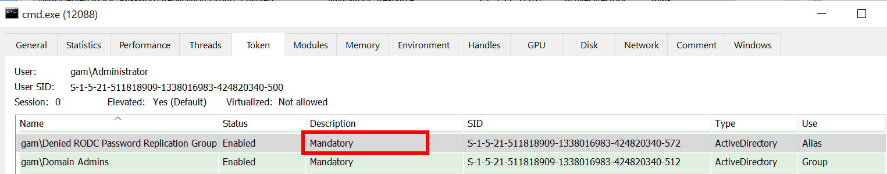
- Legit: 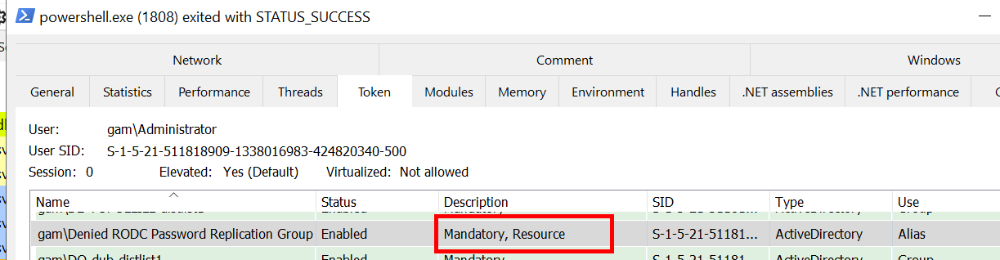

Γιατί συμβαίνει:

- Η δημιουργία PAC στο Mimikatz αφήνει τα resource-group fields κενά:
  [kuhl_m_kerberos_pac.c#L168-L172](https://github.com/gentilkiwi/mimikatz/blob/306bc6b43099c7b698f2898401fddbded6a630c8/mimikatz/modules/kerberos/kuhl_m_kerberos_pac.c#L168-L172)
- Η σημασιολογία των πεδίων ορίζεται στο MS-PAC:
  [MS-PAC / KERB_VALIDATION_INFO](https://learn.microsoft.com/en-us/openspecs/windows_protocols/ms-pac/69e86ccc-85e3-41b9-b514-7d969cd0ed73)

### Δείκτης 2: null pointer vs empty-string pointer στο LOGON_INFO

Σε wire-level NDR, string fields (`FullName`, `LogonScript`, `ProfilePath`, `HomeDirectory`,
`HomeDirectoryDrive`, `ServerName`) σε golden tickets συχνά κωδικοποιούνται ως null pointers.
Σε legitimate PAC, ακόμη και κενές τιμές συχνά αποδίδονται ως non-null pointer σε κενό array.

Σημαντικό: για network logon, το κενό `FullName` μπορεί να είναι απολύτως νόμιμο. Το σήμα είναι
η **μορφή αναπαράστασης** (null pointer vs empty-string pointer), όχι η κενότητα από μόνη της.

Εικονογράφηση (πεδίο Full name):

- Golden: 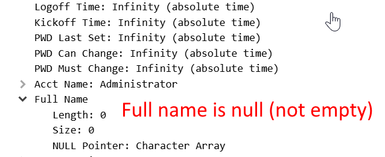
- Legit: 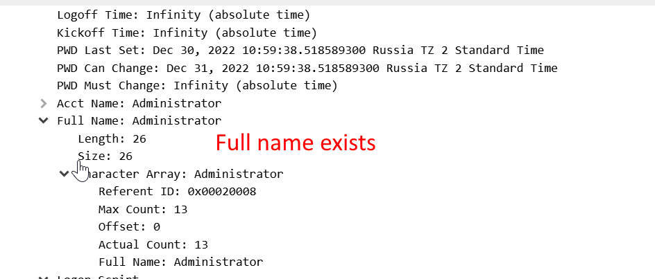

Εικονογράφηση (πεδίο Logon script):

- Golden: 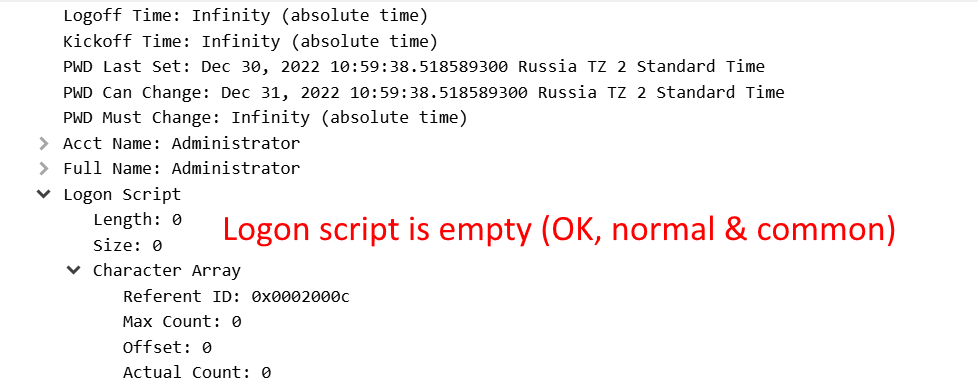
- Legit: 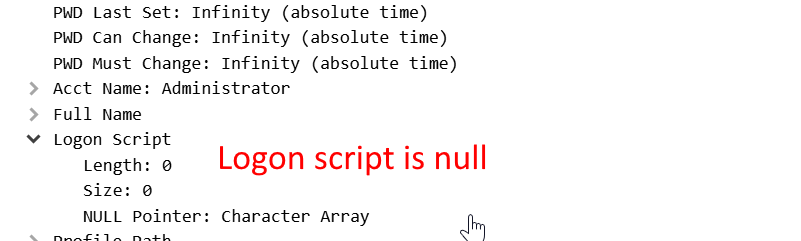

Γιατί συμβαίνει:

- Το `KERB_VALIDATION_INFO` γίνεται allocate με `LocalAlloc(LPTR, ...)`, άρα η μνήμη μηδενίζεται:
  [kuhl_m_kerberos_pac.c#L146-L173](https://github.com/gentilkiwi/mimikatz/blob/306bc6b43099c7b698f2898401fddbded6a630c8/mimikatz/modules/kerberos/kuhl_m_kerberos_pac.c#L146-L173)
- Η συμπεριφορά των πεδίων ορίζεται στο MS-PAC:
  [MS-PAC / KERB_VALIDATION_INFO](https://learn.microsoft.com/en-us/openspecs/windows_protocols/ms-pac/69e86ccc-85e3-41b9-b514-7d969cd0ed73)

### Δείκτης 3: Απουσία PAC type 12 (`UPN_DNS_INFO`)

Σε golden-ticket traces, το `UPN_DNS_INFO` (type 12) λείπει συχνά, ενώ σε legitimate paths
ο KDC συνήθως συμπεριλαμβάνει αυτό το buffer.

Εικονογράφηση (δομή UPN):

- Golden: 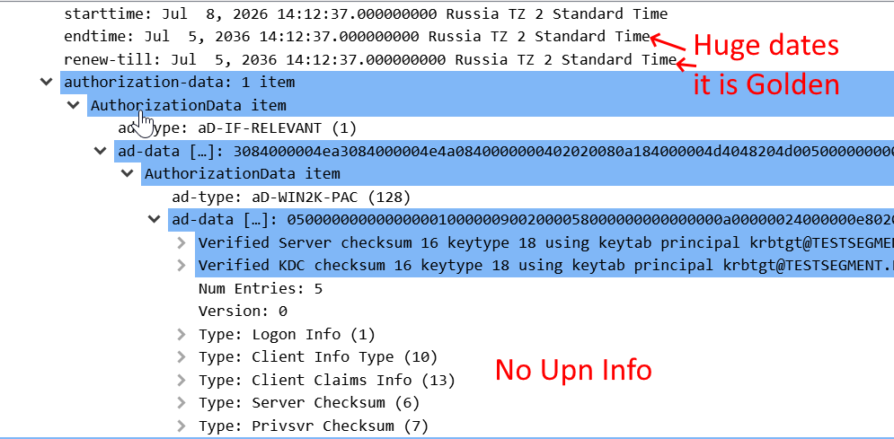
- Legit: 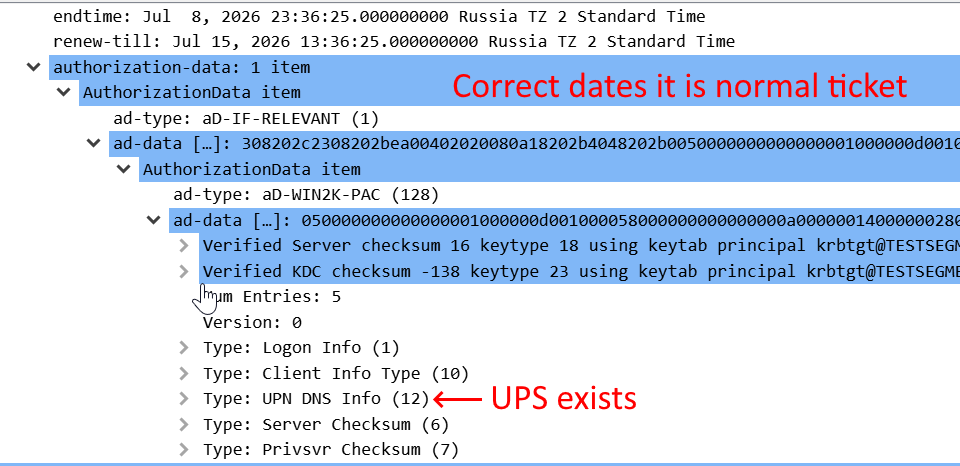

- Χάρτης PAC buffer types: [MS-PAC / PAC_INFO_BUFFER](https://learn.microsoft.com/en-us/openspecs/windows_protocols/ms-pac/3341cfa2-6ef5-42e0-b7bc-4544884bf399)
- Δομή type 12: [MS-PAC / UPN_DNS_INFO](https://learn.microsoft.com/en-us/openspecs/windows_protocols/ms-pac/1c0d6e11-6443-4846-b744-f9f810a504eb)
- Path δημιουργίας PAC στο Mimikatz (χωρίς type 12):
  [kuhl_m_kerberos_pac.c#L8](https://github.com/gentilkiwi/mimikatz/blob/306bc6b43099c7b698f2898401fddbded6a630c8/mimikatz/modules/kerberos/kuhl_m_kerberos_pac.c#L8)

### Δείκτης 4: `EffectiveName.MaximumLength = Length + 2`

Σε golden-ticket PAC συχνά εμφανίζεται `MaximumLength = Length + 2` (λόγω
`RtlInitUnicodeString`), ενώ σε legitimate PAC συχνά παρατηρείται `MaximumLength = Length`.

Εικονογράφηση (EffectiveName):

- Golden: 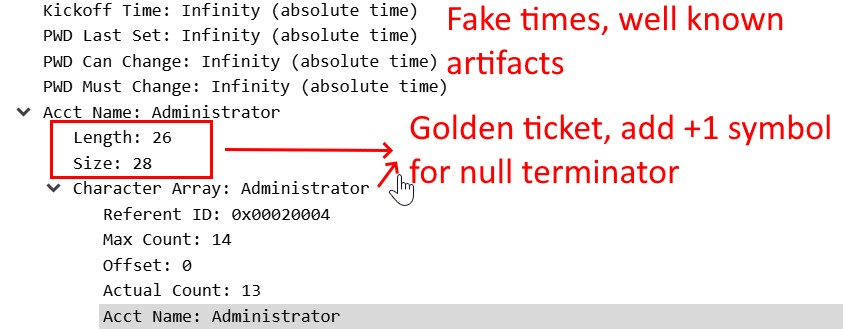
- Legit: 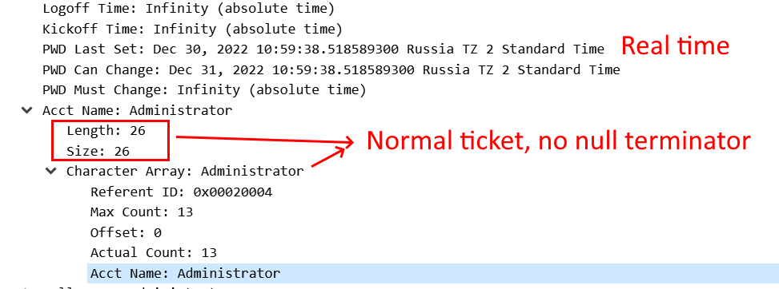

- Path εκχώρησης ονόματος: [kuhl_m_kerberos_pac.c#L157](https://github.com/gentilkiwi/mimikatz/blob/306bc6b43099c7b698f2898401fddbded6a630c8/mimikatz/modules/kerberos/kuhl_m_kerberos_pac.c#L157)
- Ορισμός πεδίου: [MS-PAC / EffectiveName](https://learn.microsoft.com/en-us/openspecs/windows_protocols/ms-pac/69e86ccc-85e3-41b9-b514-7d969cd0ed73)

### Δείκτης 5: Ιστορικά πεδία AD με μη φυσιολογικές τιμές

Τυπικό golden-ticket pattern:

- `LogonCount = 0`
- `PasswordLastSet` με `KIWI_NEVERTIME` (`MAXLONGLONG`)

Εικονογράφηση (τιμές απευθείας από το AD):

- Golden: 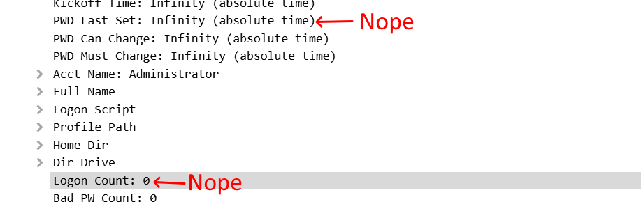
- Legit: 

Αναφορές:

- [kuhl_m_kerberos_pac.c#L154](https://github.com/gentilkiwi/mimikatz/blob/306bc6b43099c7b698f2898401fddbded6a630c8/mimikatz/modules/kerberos/kuhl_m_kerberos_pac.c#L154)
- [globals.h#L97 (KIWI_NEVERTIME)](https://github.com/gentilkiwi/mimikatz/blob/306bc6b43099c7b698f2898401fddbded6a630c8/inc/globals.h#L97)
- [MS-PAC / PasswordLastSet](https://learn.microsoft.com/en-us/openspecs/windows_protocols/ms-pac/69e86ccc-85e3-41b9-b514-7d969cd0ed73)

Σημείωση: για "password never set", η προδιαγραφή αναμένει zero FILETIME τιμή. Επομένως,
το `MAXLONGLONG` είναι χρήσιμο artifact για correlation.

### Δείκτης 6: lowercase `crealm` (heuristic)

Αν forged tickets αντιγράφουν το `crealm` απευθείας από CLI και το κρατούν lowercase,
ενώ η νόμιμη υποδομή σας συνήθως εμφανίζει uppercase canonical μορφή, αυτό είναι χρήσιμο heuristic.

Σημαντικό: χρησιμοποιείται μόνο ως συμπληρωματικό σήμα, όχι ως αυτόνομο verdict.
Για κύριες αποφάσεις προτιμήστε τα PAC/token indicators παραπάνω.

## Requirements

- Windows, **domain-joined** host.
- **Administrator** — the tool elevates to **SYSTEM** (needed for S4U logon and token access).
- .NET Framework 4.7.2+ (4.8 for LsaSecretExtractor), x64.
- Visual Studio 2022 / MSBuild; NuGet packages restored.

## Build

```text
# packages.config project: restore with nuget.exe (dotnet restore does not handle packages.config)
nuget restore FindGT.sln
msbuild FindGT.sln /p:Configuration=Release /p:Platform=x64 /m
```

## Usage

```text
FindGT [OPTIONS] [COMMAND]

OPTIONS:
  -v, --verbose   Show every group per session, not only discrepancies
      --html      Save the report as an HTML file in the current directory
  -h, --help      Show help

COMMANDS:
  test-s4u <upn> [realm]                   S4U2Self membership for one user
  test-securechannel <nthash-file> [dc]    Establish & verify a Netlogon secure channel
  test-securechannel-raw <file> [dc]       Brute-force the machine-secret derivation
  test-crypto                              Self-test MD4 / AES-CFB8
```

Default (no command) = scan all Kerberos sessions and print **only discrepancies**.

LsaSecretExtractor:

```text
LsaSecretExtractor --out <path> [--encoding hex|base64|raw] [--secret <name>] [--nthash]
```

## Output

One Spectre.Console table per session: **SID | Name | Comment**, colour-coded
(red = suspicious, yellow = missing-from-token, green = match, shown with `--verbose`).
`--html` exports a styled, self-contained UTF-8 HTML document to the current folder.

## Implemented

- [x] Machine-account secret extraction (LSA registry decrypt) — `LsaSecretExtractor`.
- [x] NRPC Netlogon secure channel (AES) — established & verified against a live DC.
- [x] S4U2Self authoritative membership (`KERB_S4U_LOGON`).
- [x] Token-vs-authoritative diff, Golden-Ticket oriented.
- [x] LDAP fallback (recursive, cycle-protected).
- [x] Spectre.Console report + `--html`; Spectre.Console.Cli command line with auto-help.

## Roadmap / TODO

- [ ] **Option B** — fully self-contained raw-Kerberos S4U2Self + U2U (independent of local
      LSASS). Detailed plan: [SlidesAndDocs/OptionB-RawKerberos-S4U2Self.md](SlidesAndDocs/OptionB-RawKerberos-S4U2Self.md).
- [ ] Standalone MSI package with service mode for continuous checks on new sessions.
- [ ] Optional / policy-driven response including logoff for suspicious sessions.
- [ ] Validate the "suspicious" (red) path against a real forged ticket in a lab.
- [ ] Secret hardening — DPAPI/CredMan storage, restrictive ACLs, field masking.
- [ ] Broader coverage — cross-domain ExtraSids, multiple DCs, more session types.
- [ ] Structured per-run log file.

> Note: NRPC `NetrLogonSamLogonEx` was evaluated as a membership source but **cannot** return
> an arbitrary user's groups without that user's credentials (no S4U at the Netlogon level), so
> S4U2Self (Kerberos) is the membership mechanism.

## Acknowledgments & License

Derived in part from [GhostPack/Koh](https://github.com/GhostPack/Koh). Free and open-source,
provided **as-is, without warranty**. For **authorized** security testing only.
