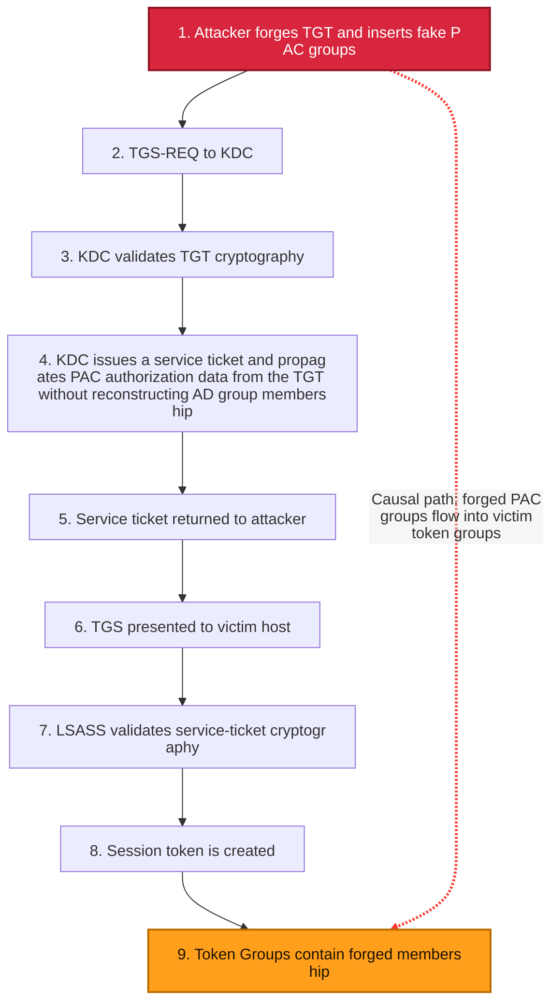
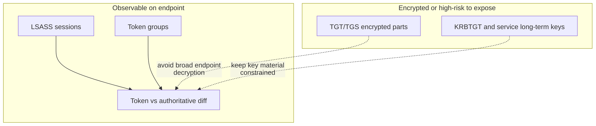

# FindGT — Golden Ticket membership anomaly detector

> README language versions:
>
> | Language | File                         |
> | -------- | ---------------------------- |
> | English  | [README.md](README.md)       |
> | Russian  | [README.ru.md](README.ru.md) |
> | Greek    | [README.el.md](README.el.md) |
>
> All language files must carry the same meaning — see [AGENTS.md](AGENTS.md).

FindGT inspects Windows **Kerberos logon sessions** and compares the group membership
**claimed by each session token** against the **authoritative membership** the domain
controller reports for that user. A Golden Ticket forges a TGT with arbitrary group SIDs
(e.g. `Domain Admins`, `Enterprise Admins`, `Schema Admins`); those forged groups appear
in the session token but **not** in the authoritative source — which is what FindGT flags.

> Status: the production-oriented service and MSI implementation is ready for
> lab validation; end-to-end confirmation with a real Golden Ticket has not yet
> been completed. Research CLI commands remain separate. Part of the original
> token/session code is based on [GhostPack/Koh](https://github.com/GhostPack/Koh).

## Why hosts trust a Golden Ticket

In Kerberos terms, trust follows valid cryptography and KDC-issued service tickets.

1. The attacker forges a TGT (Golden Ticket) and inserts fake group membership into PAC.
2. The attacker sends that TGT to the KDC in a TGS request for a victim service.
3. The KDC validates ticket cryptography (KRBTGT trust path).
4. If cryptography is valid, KDC issues a service ticket and propagates PAC authorization data from the incoming TGT without reconstructing group membership from AD at this TGS stage.
5. The attacker presents the service ticket to the victim host.
6. On the host, LSASS validates service-ticket cryptography.
7. LSASS materializes identity/group data into the logon session token.
8. The forged membership reaches the host as a trusted authorization artifact.
9. We observe it in the created session's token groups.



Static SVG: [SlidesAndDocs/diagrams/golden-ticket-trust-flow.svg](SlidesAndDocs/diagrams/golden-ticket-trust-flow.svg)

## Detection boundary: observable vs encrypted

FindGT inspects LSASS sessions and token groups because this is the practical, observable,
and safer detection surface on endpoints.

- Observable: logon sessions, token groups, SID diffs.
- Not practically observable at scale on endpoints: arbitrary ticket decryption.
- Security reason: broad decryption workflows would increase key-material exposure and attack surface.



Static SVG: [SlidesAndDocs/diagrams/findgt-observable-boundary.svg](SlidesAndDocs/diagrams/findgt-observable-boundary.svg)

## Where FindGT is strong / weak

FindGT is strongest in production-like AD environments where real operational systems create
non-trivial nested membership over time.

Low-contrast environments (weaker signal):

- Default group set only.
- Recently deployed domain with minimal identity lifecycle.
- No forest and no trusted external domains.
- Low group nesting depth.

If no mismatch is found, interpret this as "not observed in the current baseline", not as a
cryptographic proof that no attack exists.

## Note on tooling claims (Mimikatz / Rubeus)

It is inaccurate to say that modern tooling is strictly limited to one-domain membership only.
Current implementations can populate both `GroupIds` and `ExtraSids` in PAC/KERB_VALIDATION_INFO.
Whether cross-domain SIDs are honored depends on trust, SID filtering, and PAC validation policy.

Mimikatz (official upstream permalinks):

- [kuhl_m_kerberos_pac.c @ 306bc6b #L146-L173](https://github.com/gentilkiwi/mimikatz/blob/306bc6b43099c7b698f2898401fddbded6a630c8/mimikatz/modules/kerberos/kuhl_m_kerberos_pac.c#L146-L173) — fills `KERB_VALIDATION_INFO`, including `GroupIds` and `ExtraSids`.
- [kuhl_m_kerberos_pac.c @ 306bc6b #L179-L245](https://github.com/gentilkiwi/mimikatz/blob/306bc6b43099c7b698f2898401fddbded6a630c8/mimikatz/modules/kerberos/kuhl_m_kerberos_pac.c#L179-L245) — group RID parsing/default groups and SID parsing into `KERB_SID_AND_ATTRIBUTES`.
- [kuhl_m_kerberos.c @ 306bc6b #L633-L640](https://github.com/gentilkiwi/mimikatz/blob/306bc6b43099c7b698f2898401fddbded6a630c8/mimikatz/modules/kerberos/kuhl_m_kerberos.c#L633-L640) — PAC generation/sign path from validation info.

Rubeus (official upstream permalinks):

- [ForgeTicket.cs @ 74215f6 #L89-L124](https://github.com/GhostPack/Rubeus/blob/74215f68ea70bd6a66c008da91bf5fe21d20b154/Rubeus/lib/ForgeTicket.cs#L89-L124) — initializes `_KERB_VALIDATION_INFO`, defaults for `GroupIds`/`ExtraSids`.
- [ForgeTicket.cs @ 74215f6 #L576-L592](https://github.com/GhostPack/Rubeus/blob/74215f68ea70bd6a66c008da91bf5fe21d20b154/Rubeus/lib/ForgeTicket.cs#L576-L592) — loops to populate `GroupIds` and `ExtraSids`.
- [Kerberos_PAC.cs @ 74215f6 #L681-L784](https://github.com/GhostPack/Rubeus/blob/74215f68ea70bd6a66c008da91bf5fe21d20b154/Rubeus/lib/krb_structures/pac/Ndr/Kerberos_PAC.cs#L681-L784) — `_KERB_VALIDATION_INFO` structure with `GroupIds` and `ExtraSids` fields.

## How it works

1. The service subscribes to Security Event 4624 first, then enumerates existing
   LSA sessions and starts periodic reconciliation.
2. The callback parses XML by `Data/@Name`, preserves the full 64-bit
   `TargetLogonId`, and only enqueues a candidate in a bounded queue.
3. A worker confirms the session with `LsaGetLogonSessionData`; the final
   Kerberos filter uses the LSA `AuthenticationPackage`.
4. Token group SIDs are retained **with their attributes**. Optional
   `PowerfulOnly` uses structural RID/SID checks and is disabled by default.
5. Authoritative membership comes from S4U2Self with recursive LDAP fallback.
   If both references are unavailable, the verdict is `Unknown`, never `Clean`.
6. The FGT001–FGT010 rule engine writes the full result to
   `FindGT/Operational`; an Authz Security summary defaults to `Suspicious` only.

The CLI and service use the same typed analyzer. Because S4U2Self queries the DC
again under the machine identity, a Golden Ticket in the user session cannot
change the authoritative response.

## Components

| Project | Purpose | Platform |
| --- | --- | --- |
| **FindGT** | Preserved Spectre.Console CLI and NRPC/S4U diagnostics. | .NET Framework 4.8, x64 |
| **FindGT.Core** | LSA/token ownership, full LUID, membership providers, PowerfulOnly, rules, and typed analyzer. | .NET Framework 4.8, x64 |
| **FindGT.Eventing** | 4624 parser/watcher, bookmark, queue/dedupe, and Operational/Authz/JSON sinks. | .NET Framework 4.8, x64 |
| **FindGT.Service** | Separate `ServiceBase` host with reconciliation, retries, health, and safe shutdown. | .NET Framework 4.8, x64 |
| **FindGT.EventMessages** | Manifest and message-resource DLLs for Operational and Authz Security events. | Native x64 |
| **FindGT.SetupActions** | Minimal native MSI actions for Authz, ACLs, and service recovery. | Native x64 |
| **FindGT.Setup** | WiX 7 x64 per-machine MSI. | WiX Toolset 7.0.0 |
| **FindGT.Tests** | Unit tests for Core/Eventing/Service/MSI contracts. | MSTest 4.3.3, x64 |
| **LsaSecretExtractor** | Separate research helper; excluded from the MSI. | .NET Framework 4.8 |

## Windows service and MSI

- Service name: `FindGT`; account: `LocalSystem`; startup: Automatic (Delayed Start).
- Default logon types: 3 (Network) and 10 (RemoteInteractive).
- Configuration: `%ProgramData%\FindGT\Config\FindGT.settings.json`.
- Bookmark: `%ProgramData%\FindGT\State\Security.bookmark.xml`.
- Primary log: Applications and Services Logs → `FindGT/Operational`.
- Security output uses Authz; the installer and service do not change audit policy.
- JSONL is disabled by default and uses protected ProgramData when enabled.
- The MSI is unsigned until a production certificate is available; verify SHA-256.

See [architecture](docs/architecture/service-architecture.md),
[MSI installation](docs/installation/msi.md),
[configuration](docs/operations/configuration.md), and
[troubleshooting](docs/operations/troubleshooting.md).

## Indicators of Golden Tickets

Below are practical artifacts that help distinguish forged tickets from KDC-issued tickets in
real investigations. Treat them as a signal set, not a single magic test.

### Indicator 1: Resource-group representation of RID 572

For `Domain Admins`, the `Denied RODC Password Replication Group` (RID 572) context is critical.

- In forged (golden) paths, this group may appear as a regular group.
- In legitimate paths, it appears in token context as `Mandatory, Resource`.

Illustration:

- Golden: 
- Legit: 

Why this is possible:

- Mimikatz PAC generation leaves resource-group fields unpopulated:
  [kuhl_m_kerberos_pac.c#L168-L172](https://github.com/gentilkiwi/mimikatz/blob/306bc6b43099c7b698f2898401fddbded6a630c8/mimikatz/modules/kerberos/kuhl_m_kerberos_pac.c#L168-L172)
- Field semantics are defined in MS-PAC:
  [MS-PAC / KERB_VALIDATION_INFO](https://learn.microsoft.com/en-us/openspecs/windows_protocols/ms-pac/69e86ccc-85e3-41b9-b514-7d969cd0ed73)

### Indicator 2: null pointer vs empty-string pointer in LOGON_INFO

At wire-level NDR, string fields (`FullName`, `LogonScript`, `ProfilePath`, `HomeDirectory`,
`HomeDirectoryDrive`, `ServerName`) in golden tickets are often encoded as null pointers.
In legitimate PAC, even empty values are often represented as a non-null pointer to an empty array.

Important: for network logon, empty `FullName` can be legitimate. The signal is the
**representation form** (null pointer vs empty-string pointer), not emptiness alone.

Illustration (Full name field):

- Golden: 
- Legit: 

Illustration (Logon script field):

- Golden: 
- Legit: 

Why this happens:

- `KERB_VALIDATION_INFO` is allocated with `LocalAlloc(LPTR, ...)`, so memory is zeroed:
  [kuhl_m_kerberos_pac.c#L146-L173](https://github.com/gentilkiwi/mimikatz/blob/306bc6b43099c7b698f2898401fddbded6a630c8/mimikatz/modules/kerberos/kuhl_m_kerberos_pac.c#L146-L173)
- Field behavior is defined in MS-PAC:
  [MS-PAC / KERB_VALIDATION_INFO](https://learn.microsoft.com/en-us/openspecs/windows_protocols/ms-pac/69e86ccc-85e3-41b9-b514-7d969cd0ed73)

### Indicator 3: missing PAC type 12 (`UPN_DNS_INFO`)

In golden-ticket traces, `UPN_DNS_INFO` (type 12) is often missing, while in legitimate paths
KDC usually includes this buffer.

Illustration (UPN structure):

- Golden: 
- Legit: 

- PAC buffer type map: [MS-PAC / PAC_INFO_BUFFER](https://learn.microsoft.com/en-us/openspecs/windows_protocols/ms-pac/3341cfa2-6ef5-42e0-b7bc-4544884bf399)
- Type 12 structure: [MS-PAC / UPN_DNS_INFO](https://learn.microsoft.com/en-us/openspecs/windows_protocols/ms-pac/1c0d6e11-6443-4846-b744-f9f810a504eb)
- Mimikatz PAC creation path (without type 12):
  [kuhl_m_kerberos_pac.c#L8](https://github.com/gentilkiwi/mimikatz/blob/306bc6b43099c7b698f2898401fddbded6a630c8/mimikatz/modules/kerberos/kuhl_m_kerberos_pac.c#L8)

### Indicator 4: `EffectiveName.MaximumLength = Length + 2`

Golden-ticket PAC often shows `MaximumLength = Length + 2` (from `RtlInitUnicodeString`),
whereas legitimate PAC frequently shows `MaximumLength = Length`.

Illustration (EffectiveName):

- Golden: 
- Legit: 

- Name assignment path: [kuhl_m_kerberos_pac.c#L157](https://github.com/gentilkiwi/mimikatz/blob/306bc6b43099c7b698f2898401fddbded6a630c8/mimikatz/modules/kerberos/kuhl_m_kerberos_pac.c#L157)
- Field definition: [MS-PAC / EffectiveName](https://learn.microsoft.com/en-us/openspecs/windows_protocols/ms-pac/69e86ccc-85e3-41b9-b514-7d969cd0ed73)

### Indicator 5: historical AD fields look unnatural

Typical golden-ticket pattern:

- `LogonCount = 0`
- `PasswordLastSet` assigned via `KIWI_NEVERTIME` (`MAXLONGLONG`)

Illustration (values sourced directly from AD):

- Golden: 
- Legit: 

References:

- [kuhl_m_kerberos_pac.c#L154](https://github.com/gentilkiwi/mimikatz/blob/306bc6b43099c7b698f2898401fddbded6a630c8/mimikatz/modules/kerberos/kuhl_m_kerberos_pac.c#L154)
- [globals.h#L97 (KIWI_NEVERTIME)](https://github.com/gentilkiwi/mimikatz/blob/306bc6b43099c7b698f2898401fddbded6a630c8/inc/globals.h#L97)
- [MS-PAC / PasswordLastSet](https://learn.microsoft.com/en-us/openspecs/windows_protocols/ms-pac/69e86ccc-85e3-41b9-b514-7d969cd0ed73)

Note: for "password never set", spec expects a zero FILETIME value. Therefore `MAXLONGLONG`
is a useful artifact for correlation.

### Indicator 6: lowercase `crealm` (heuristic)

If forged tickets copy `crealm` directly from CLI and keep lowercase, while your legitimate
infrastructure usually presents uppercase canonical form, this is a useful heuristic.

Important: use only as a supplementary signal, not a standalone verdict.
Prefer PAC/token indicators above for primary decisions.

---

## Requirements

- Runtime: domain-joined Windows x64 with .NET Framework 4.8; the first lab
  target is Windows Server 2019.
- An administrator installs the service, which runs as LocalSystem. Only the
  interactive CLI uses legacy SYSTEM impersonation when required.
- Build: Visual Studio 2022 with MSBuild, Desktop C++/Windows SDK, NuGet CLI,
  .NET SDK 8+ for WiX SDK restore, and WiX Toolset 7.0.0.
- WiX 7 requires explicit acceptance of the `wix7` OSMF EULA.

## Build

```powershell
.\tools\Build-Release.ps1 -ProductVersion 1.0.0
```

The script restores classic `packages.config` and the WiX SDK, builds
`Release|x64`, runs tests, ICE validation, and MSI table assertions.
Output: `FindGT.Setup\bin\x64\Release\FindGT-1.0.0-x64.msi`.

## Usage

```console
FindGT [OPTIONS] [COMMAND]

OPTIONS:
  -v, --verbose   Show every group per session, not only discrepancies
      --html      Save the report as an HTML file in the current directory
  -h, --help      Show help

COMMANDS:
  test-s4u <upn> [realm]                   S4U2Self membership for one user
  test-securechannel <nthash-file> [dc]    Establish & verify a Netlogon secure channel
  test-securechannel-raw <file> [dc]       Brute-force the machine-secret derivation
  test-crypto                              Self-test MD4 / AES-CFB8
```

Default (no command) = scan all Kerberos sessions and print **only discrepancies**.

Silent MSI install without immediately starting the service:

```powershell
msiexec.exe /i .\FindGT-1.0.0-x64.msi /qn START_SERVICE=0 `
  SECURITY_SINK_MODE=SuspiciousOnly ENABLE_JSON_SINK=0 `
  /L*v .\FindGT-install.log
```

The interactive MSI exposes options for service start, existing sessions,
Security, JSON, PowerfulOnly, and configuration retention. The same options are
public MSI properties; see the [installation guide](docs/installation/msi.md).

## Output

One Spectre.Console table per session: **SID | Name | Comment**, colour-coded
(red = suspicious, yellow = missing-from-token, green = match, shown with `--verbose`).
`--html` exports a styled, self-contained UTF-8 HTML document to the current folder.

The service writes a terminal result for every evaluated session to
`FindGT/Operational`. Events include `AnalysisId`, full LUID, trigger metadata,
verdict, rule IDs, reference status, and bounded evidence. A Security event
contains only a summary and correlates with Operational by `AnalysisId`.

## Implemented

- [x] Preserved CLI and shared `FindGT.Core` on .NET Framework 4.8 x64.
- [x] Full 64-bit LUID, SafeHandle ownership, and boot-aware dedupe.
- [x] S4U2Self authoritative membership (`KERB_S4U_LOGON`).
- [x] LDAP fallback without success-shaped partial results.
- [x] Typed verdict and FGT001–FGT010 rule engine.
- [x] Named-field Event 4624 parser/watcher, bounded queue, bookmark, and reconciliation.
- [x] LocalSystem Windows service with retries, health states, and bounded shutdown.
- [x] Manifest-based Operational, Authz Security, and optional JSONL sinks.
- [x] WiX 7 x64 MSI with interactive/silent options, ACL/Authz/service recovery actions.
- [x] Unit tests, reproducible build scripts, and Windows 2022 CI/release workflows.
- [x] NRPC and `LsaSecretExtractor` retained as separate research diagnostics.

## Roadmap / TODO

- [ ] Validate MSI install/repair/upgrade/uninstall and event registration in a
      disposable Windows environment.
- [ ] Run the end-to-end lab test: legitimate admin, an existing forged session
      through startup reconciliation, and a new Golden Ticket logon with a real 4624.
- [ ] Capture evidence for PowerfulOnly and DC unavailable → `Unknown`.
- [ ] Enable production code signing after a certificate is provided.
- [ ] **Option B** — fully self-contained raw-Kerberos S4U2Self + U2U (independent of local
      LSASS). Detailed plan: [SlidesAndDocs/OptionB-RawKerberos-S4U2Self.md](SlidesAndDocs/OptionB-RawKerberos-S4U2Self.md).
- [ ] Optional / policy-driven response including logoff for suspicious sessions.
- [ ] Expand multi-DC/cross-forest validation and SIEM mappings.

> Note: NRPC `NetrLogonSamLogonEx` was evaluated as a membership source but **cannot** return
> an arbitrary user's groups without that user's credentials (no S4U at the Netlogon level), so
> S4U2Self (Kerberos) is the membership mechanism.

## Acknowledgments & License

Derived in part from [GhostPack/Koh](https://github.com/GhostPack/Koh). Free and open-source,
provided **as-is, without warranty**. For **authorized** security testing only.
