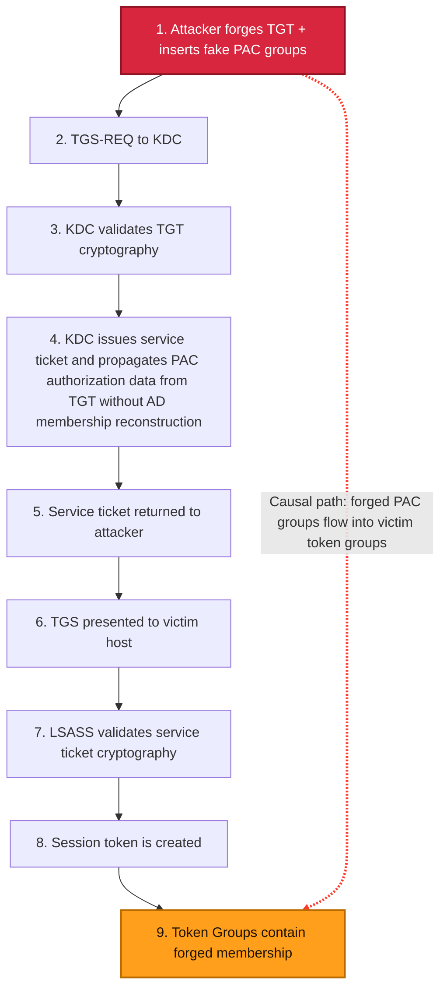
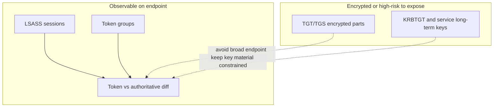

# FindGT — Golden Ticket membership anomaly detector

> README language versions:
>
> | Language | File                         |
> | -------- | ---------------------------- |
> | English  | [README.md](README.md)       |
> | Russian  | [README.ru.md](README.ru.md) |
> | Greek    | [README.el.md](README.el.md) |
>
> All language files must carry the same meaning — see [AGENTS.md](AGENTS.md).

FindGT inspects Windows **Kerberos logon sessions** and compares the group membership
**claimed by each session token** against the **authoritative membership** the domain
controller reports for that user. A Golden Ticket forges a TGT with arbitrary group SIDs
(e.g. `Domain Admins`, `Enterprise Admins`, `Schema Admins`); those forged groups appear
in the session token but **not** in the authoritative source — which is what FindGT flags.

> Research / PoC tool. A large amount of token/session code is derived from
> [GhostPack/Koh](https://github.com/GhostPack/Koh).

## Why hosts trust a Golden Ticket

In Kerberos terms, trust follows valid cryptography and KDC-issued service tickets.

1. The attacker forges a TGT (Golden Ticket) and inserts fake group membership into PAC.
2. The attacker sends that TGT to the KDC in a TGS request for a victim service.
3. The KDC validates ticket cryptography (KRBTGT trust path).
4. If cryptography is valid, KDC issues a service ticket and propagates PAC authorization data from the incoming TGT without reconstructing group membership from AD at this TGS stage.
5. The attacker presents the service ticket to the victim host.
6. On the host, LSASS validates service-ticket cryptography.
7. LSASS materializes identity/group data into the logon session token.
8. The forged membership reaches the host as a trusted authorization artifact.
9. We observe it in the created session's token groups.



Static SVG: [SlidesAndDocs/diagrams/golden-ticket-trust-flow.svg](SlidesAndDocs/diagrams/golden-ticket-trust-flow.svg)

## Detection boundary: observable vs encrypted

FindGT inspects LSASS sessions and token groups because this is the practical, observable,
and safer detection surface on endpoints.

- Observable: logon sessions, token groups, SID diffs.
- Not practically observable at scale on endpoints: arbitrary ticket decryption.
- Security reason: broad decryption workflows would increase key-material exposure and attack surface.



Static SVG: [SlidesAndDocs/diagrams/findgt-observable-boundary.svg](SlidesAndDocs/diagrams/findgt-observable-boundary.svg)

## Where FindGT is strong / weak

FindGT is strongest in production-like AD environments where real operational systems create
non-trivial nested membership over time.

Low-contrast environments (weaker signal):

- Default group set only.
- Recently deployed domain with minimal identity lifecycle.
- No forest and no trusted external domains.
- Low group nesting depth.

If no mismatch is found, interpret this as "not observed in the current baseline", not as a
cryptographic proof that no attack exists.

## Note on tooling claims (Mimikatz / Rubeus)

It is inaccurate to say that modern tooling is strictly limited to one-domain membership only.
Current implementations can populate both `GroupIds` and `ExtraSids` in PAC/KERB_VALIDATION_INFO.
Whether cross-domain SIDs are honored depends on trust, SID filtering, and PAC validation policy.

Mimikatz (official upstream permalinks):

- [kuhl_m_kerberos_pac.c @ 306bc6b #L146-L173](https://github.com/gentilkiwi/mimikatz/blob/306bc6b43099c7b698f2898401fddbded6a630c8/mimikatz/modules/kerberos/kuhl_m_kerberos_pac.c#L146-L173) — fills `KERB_VALIDATION_INFO`, including `GroupIds` and `ExtraSids`.
- [kuhl_m_kerberos_pac.c @ 306bc6b #L179-L245](https://github.com/gentilkiwi/mimikatz/blob/306bc6b43099c7b698f2898401fddbded6a630c8/mimikatz/modules/kerberos/kuhl_m_kerberos_pac.c#L179-L245) — group RID parsing/default groups and SID parsing into `KERB_SID_AND_ATTRIBUTES`.
- [kuhl_m_kerberos.c @ 306bc6b #L633-L640](https://github.com/gentilkiwi/mimikatz/blob/306bc6b43099c7b698f2898401fddbded6a630c8/mimikatz/modules/kerberos/kuhl_m_kerberos.c#L633-L640) — PAC generation/sign path from validation info.

Rubeus (official upstream permalinks):

- [ForgeTicket.cs @ 74215f6 #L89-L124](https://github.com/GhostPack/Rubeus/blob/74215f68ea70bd6a66c008da91bf5fe21d20b154/Rubeus/lib/ForgeTicket.cs#L89-L124) — initializes `_KERB_VALIDATION_INFO`, defaults for `GroupIds`/`ExtraSids`.
- [ForgeTicket.cs @ 74215f6 #L576-L592](https://github.com/GhostPack/Rubeus/blob/74215f68ea70bd6a66c008da91bf5fe21d20b154/Rubeus/lib/ForgeTicket.cs#L576-L592) — loops to populate `GroupIds` and `ExtraSids`.
- [Kerberos_PAC.cs @ 74215f6 #L681-L784](https://github.com/GhostPack/Rubeus/blob/74215f68ea70bd6a66c008da91bf5fe21d20b154/Rubeus/lib/krb_structures/pac/Ndr/Kerberos_PAC.cs#L681-L784) — `_KERB_VALIDATION_INFO` structure with `GroupIds` and `ExtraSids` fields.

## How it works

1. Enumerate logon sessions (LSA) and keep the **Kerberos** ones.
2. For each session, read the **domain group SIDs** (`S-1-5-21-*`) from the session token.
3. Compute the **authoritative** membership for the same user:
   - **Primary — Kerberos S4U2Self** (`KERB_S4U_LOGON` via `LsaLogonUser`). The machine
     account asks the KDC for a ticket-to-self impersonating the user; the KDC builds a
     **fresh PAC from current AD state**, independent of the user's (possibly forged) TGT.
   - **Fallback — LDAP** recursive group walk (cycle-protected, depth-capped at 64).
4. **Diff** the two sets and report:
   - in token **but not** authoritative → **suspicious** (possible forgery, red),
   - authoritative **but not** in token → informational (yellow),
   - a member SID that is a **user**, not a group → highlighted.

Because S4U2Self queries the DC fresh with the _machine's_ identity, a Golden Ticket in the
user's session cannot influence the authoritative answer.

## Components

| Project                | Purpose                                                                                                      | TFM                       |
| ---------------------- | ------------------------------------------------------------------------------------------------------------ | ------------------------- |
| **FindGT**             | Main tool: session scan, membership diff, Spectre.Console report, NRPC secure-channel + S4U diagnostics.     | .NET Framework 4.7.2, x64 |
| **LsaSecretExtractor** | Extracts the machine-account secret / NT hash from LSA (registry decrypt) to a file, for NRPC bootstrapping. | .NET Framework 4.8        |

## Indicators of Golden Tickets

Below are practical artifacts that help distinguish forged tickets from KDC-issued tickets in
real investigations. Treat them as a signal set, not a single magic test.

### Indicator 1: Resource-group representation of RID 572

For `Domain Admins`, the `Denied RODC Password Replication Group` (RID 572) context is critical.

- In forged (golden) paths, this group may appear as a regular group.
- In legitimate paths, it appears in token context as `Mandatory, Resource`.

Illustration:

- Golden: 
- Legit: 

Why this is possible:

- Mimikatz PAC generation leaves resource-group fields unpopulated:
  [kuhl_m_kerberos_pac.c#L168-L172](https://github.com/gentilkiwi/mimikatz/blob/306bc6b43099c7b698f2898401fddbded6a630c8/mimikatz/modules/kerberos/kuhl_m_kerberos_pac.c#L168-L172)
- Field semantics are defined in MS-PAC:
  [MS-PAC / KERB_VALIDATION_INFO](https://learn.microsoft.com/en-us/openspecs/windows_protocols/ms-pac/69e86ccc-85e3-41b9-b514-7d969cd0ed73)

### Indicator 2: null pointer vs empty-string pointer in LOGON_INFO

At wire-level NDR, string fields (`FullName`, `LogonScript`, `ProfilePath`, `HomeDirectory`,
`HomeDirectoryDrive`, `ServerName`) in golden tickets are often encoded as null pointers.
In legitimate PAC, even empty values are often represented as a non-null pointer to an empty array.

Important: for network logon, empty `FullName` can be legitimate. The signal is the
**representation form** (null pointer vs empty-string pointer), not emptiness alone.

Why this happens:

- `KERB_VALIDATION_INFO` is allocated with `LocalAlloc(LPTR, ...)`, so memory is zeroed:
  [kuhl_m_kerberos_pac.c#L146-L173](https://github.com/gentilkiwi/mimikatz/blob/306bc6b43099c7b698f2898401fddbded6a630c8/mimikatz/modules/kerberos/kuhl_m_kerberos_pac.c#L146-L173)
- Field behavior is defined in MS-PAC:
  [MS-PAC / KERB_VALIDATION_INFO](https://learn.microsoft.com/en-us/openspecs/windows_protocols/ms-pac/69e86ccc-85e3-41b9-b514-7d969cd0ed73)

### Indicator 3: missing PAC type 12 (`UPN_DNS_INFO`)

In golden-ticket traces, `UPN_DNS_INFO` (type 12) is often missing, while in legitimate paths
KDC usually includes this buffer.

- PAC buffer type map: [MS-PAC / PAC_INFO_BUFFER](https://learn.microsoft.com/en-us/openspecs/windows_protocols/ms-pac/3341cfa2-6ef5-42e0-b7bc-4544884bf399)
- Type 12 structure: [MS-PAC / UPN_DNS_INFO](https://learn.microsoft.com/en-us/openspecs/windows_protocols/ms-pac/1c0d6e11-6443-4846-b744-f9f810a504eb)
- Mimikatz PAC creation path (without type 12):
  [kuhl_m_kerberos_pac.c#L8](https://github.com/gentilkiwi/mimikatz/blob/306bc6b43099c7b698f2898401fddbded6a630c8/mimikatz/modules/kerberos/kuhl_m_kerberos_pac.c#L8)

### Indicator 4: `EffectiveName.MaximumLength = Length + 2`

Golden-ticket PAC often shows `MaximumLength = Length + 2` (from `RtlInitUnicodeString`),
whereas legitimate PAC frequently shows `MaximumLength = Length`.

- Name assignment path: [kuhl_m_kerberos_pac.c#L157](https://github.com/gentilkiwi/mimikatz/blob/306bc6b43099c7b698f2898401fddbded6a630c8/mimikatz/modules/kerberos/kuhl_m_kerberos_pac.c#L157)
- Field definition: [MS-PAC / EffectiveName](https://learn.microsoft.com/en-us/openspecs/windows_protocols/ms-pac/69e86ccc-85e3-41b9-b514-7d969cd0ed73)

### Indicator 5: historical AD fields look unnatural

Typical golden-ticket pattern:

- `LogonCount = 0`
- `PasswordLastSet` assigned via `KIWI_NEVERTIME` (`MAXLONGLONG`)

References:

- [kuhl_m_kerberos_pac.c#L154](https://github.com/gentilkiwi/mimikatz/blob/306bc6b43099c7b698f2898401fddbded6a630c8/mimikatz/modules/kerberos/kuhl_m_kerberos_pac.c#L154)
- [globals.h#L97 (KIWI_NEVERTIME)](https://github.com/gentilkiwi/mimikatz/blob/306bc6b43099c7b698f2898401fddbded6a630c8/inc/globals.h#L97)
- [MS-PAC / PasswordLastSet](https://learn.microsoft.com/en-us/openspecs/windows_protocols/ms-pac/69e86ccc-85e3-41b9-b514-7d969cd0ed73)

Note: for "password never set", spec expects a zero FILETIME value. Therefore `MAXLONGLONG`
is a useful artifact for correlation.

### Indicator 6: lowercase `crealm` (heuristic)

If forged tickets copy `crealm` directly from CLI and keep lowercase, while your legitimate
infrastructure usually presents uppercase canonical form, this is a useful heuristic.

Important: use only as a supplementary signal, not a standalone verdict.
Prefer PAC/token indicators above for primary decisions.

---

## Requirements

- Windows, **domain-joined** host.
- **Administrator** — the tool elevates to **SYSTEM** (needed for S4U logon and token access).
- .NET Framework 4.7.2+ (4.8 for LsaSecretExtractor), x64.
- Visual Studio 2022 / MSBuild; NuGet packages restored.

## Build

```text
# packages.config project: restore with nuget.exe (dotnet restore does not handle packages.config)
nuget restore FindGT.sln
msbuild FindGT.sln /p:Configuration=Release /p:Platform=x64 /m
```

## Usage

```text
FindGT [OPTIONS] [COMMAND]

OPTIONS:
  -v, --verbose   Show every group per session, not only discrepancies
      --html      Save the report as an HTML file in the current directory
  -h, --help      Show help

COMMANDS:
  test-s4u <upn> [realm]                   S4U2Self membership for one user
  test-securechannel <nthash-file> [dc]    Establish & verify a Netlogon secure channel
  test-securechannel-raw <file> [dc]       Brute-force the machine-secret derivation
  test-crypto                              Self-test MD4 / AES-CFB8
```

Default (no command) = scan all Kerberos sessions and print **only discrepancies**.

LsaSecretExtractor:

```text
LsaSecretExtractor --out <path> [--encoding hex|base64|raw] [--secret <name>] [--nthash]
```

## Output

One Spectre.Console table per session: **SID | Name | Comment**, colour-coded
(red = suspicious, yellow = missing-from-token, green = match, shown with `--verbose`).
`--html` exports a styled, self-contained UTF-8 HTML document to the current folder.

## Implemented

- [x] Machine-account secret extraction (LSA registry decrypt) — `LsaSecretExtractor`.
- [x] NRPC Netlogon secure channel (AES) — established & verified against a live DC.
- [x] S4U2Self authoritative membership (`KERB_S4U_LOGON`).
- [x] Token-vs-authoritative diff, Golden-Ticket oriented.
- [x] LDAP fallback (recursive, cycle-protected).
- [x] Spectre.Console report + `--html`; Spectre.Console.Cli command line with auto-help.

## Roadmap / TODO

- [ ] **Option B** — fully self-contained raw-Kerberos S4U2Self + U2U (independent of local
      LSASS). Detailed plan: [SlidesAndDocs/OptionB-RawKerberos-S4U2Self.md](SlidesAndDocs/OptionB-RawKerberos-S4U2Self.md).
- [ ] Standalone MSI package with service mode for continuous checks on new sessions.
- [ ] Optional / policy-driven response including logoff for suspicious sessions.
- [ ] Validate the "suspicious" (red) path against a real forged ticket in a lab.
- [ ] Secret hardening — DPAPI/CredMan storage, restrictive ACLs, field masking.
- [ ] Broader coverage — cross-domain ExtraSids, multiple DCs, more session types.
- [ ] Structured per-run log file.

> Note: NRPC `NetrLogonSamLogonEx` was evaluated as a membership source but **cannot** return
> an arbitrary user's groups without that user's credentials (no S4U at the Netlogon level), so
> S4U2Self (Kerberos) is the membership mechanism.

## Acknowledgments & License

Derived in part from [GhostPack/Koh](https://github.com/GhostPack/Koh). Free and open-source,
provided **as-is, without warranty**. For **authorized** security testing only.
