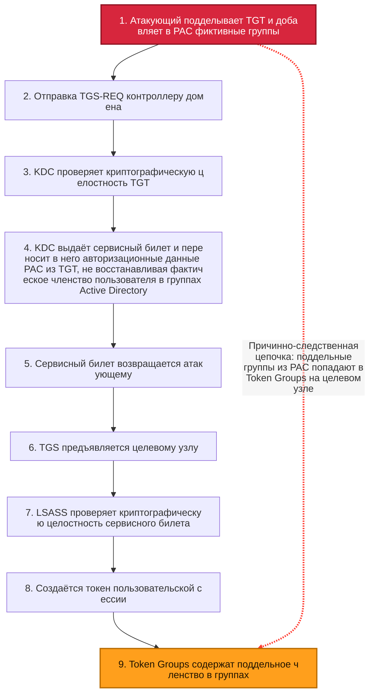
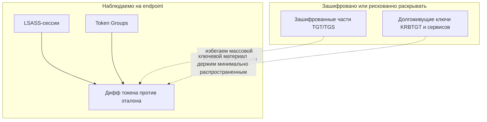

# FindGT — детектор аномалий членства для Golden Ticket

> Версии README по языкам:
>
> | Язык    | Файл                         |
> | ------- | ---------------------------- |
> | English | [README.md](README.md)       |
> | Russian | [README.ru.md](README.ru.md) |
> | Greek   | [README.el.md](README.el.md) |
>
> Файлы README на всех языках должны быть эквивалентны по смыслу — см. [AGENTS.md](AGENTS.md).

FindGT проверяет **Kerberos‑сессии входа** Windows и сравнивает членство в группах,
**заявленное токеном каждой сессии**, с **авторитетным членством**, которое для этого
пользователя сообщает контроллер домена. Golden Ticket подделывает TGT с произвольными
SID групп (`Domain Admins`, `Enterprise Admins`, `Schema Admins` и т.п.); такие поддельные
группы есть в токене сессии, но **отсутствуют** в авторитетном источнике — именно это и
выявляет FindGT.

> Исследовательский / PoC‑инструмент. Значительная часть кода работы с токенами/сессиями
> заимствована из [GhostPack/Koh](https://github.com/GhostPack/Koh).

## Почему хосты доверяют Golden Ticket

В Kerberos доверие строится вокруг валидной криптографии и сервисных билетов, выданных KDC.

1. Атакующий подделывает TGT (Golden Ticket) и помещает фейковое членство в PAC.
2. Атакующий отправляет этот TGT на KDC в запросе TGS к целевому сервису.
3. KDC проверяет криптографическую валидность билета (доверительный путь KRBTGT).
4. Если криптография валидна, KDC выпускает сервисный билет и переносит PAC-данные авторизации из входящего TGT, не перестраивая членство по AD на этом TGS-этапе.
5. Атакующий предъявляет сервисный билет хосту-жертве.
6. На хосте LSASS проверяет криптографию сервисного билета.
7. LSASS материализует данные идентичности/групп в токене сессии.
8. Поддельное членство приходит на хост как «доверенный» артефакт авторизации.
9. Мы видим это в token groups созданной сессии.



Статическая SVG-версия: [SlidesAndDocs/diagrams/golden-ticket-trust-flow.svg](SlidesAndDocs/diagrams/golden-ticket-trust-flow.svg)

## Граница детектирования: наблюдаемое против зашифрованного

FindGT анализирует LSASS-сессии и token groups, потому что это практичный, наблюдаемый и более
безопасный слой детектирования на endpoint.

- Наблюдаемое: сессии входа, token groups, SID-расхождения.
- Непрактично как массовый endpoint-подход: произвольная дешифрация билетов.
- Причина безопасности: такой подход расширяет экспозицию ключевого материала и поверхность атаки.



Статическая SVG-версия: [SlidesAndDocs/diagrams/findgt-observable-boundary.svg](SlidesAndDocs/diagrams/findgt-observable-boundary.svg)

## Где FindGT сильнее / слабее

FindGT наиболее информативен в production-like AD-средах, где за время эксплуатации накопилось
реальное нетривиальное вложенное членство.

Среды с низким контрастом (сигнал слабее):

- Только дефолтный набор групп.
- Недавно развернутый домен с минимальным жизненным циклом идентичностей.
- Нет леса и нет доверенных внешних доменов.
- Небольшая глубина вложенности групп.

Если расхождения не найдены, это корректнее трактовать как «не обнаружено в текущем baseline»,
а не как криптографическое доказательство отсутствия атаки.

## Примечание по утверждениям о Mimikatz / Rubeus

Некорректно утверждать, что современные инструменты строго ограничены только "однодоменным"
членством. Текущие реализации умеют заполнять и `GroupIds`, и `ExtraSids` в
PAC/KERB_VALIDATION_INFO. Будут ли междоменный SID реально принят, определяют trust, SID
filtering и PAC validation политики конкретной среды.

Mimikatz (официальные upstream permalink):

- [kuhl_m_kerberos_pac.c @ 306bc6b #L146-L173](https://github.com/gentilkiwi/mimikatz/blob/306bc6b43099c7b698f2898401fddbded6a630c8/mimikatz/modules/kerberos/kuhl_m_kerberos_pac.c#L146-L173) — заполнение `KERB_VALIDATION_INFO`, включая `GroupIds` и `ExtraSids`.
- [kuhl_m_kerberos_pac.c @ 306bc6b #L179-L245](https://github.com/gentilkiwi/mimikatz/blob/306bc6b43099c7b698f2898401fddbded6a630c8/mimikatz/modules/kerberos/kuhl_m_kerberos_pac.c#L179-L245) — парсинг RID-групп/дефолтных групп и разбор SID в `KERB_SID_AND_ATTRIBUTES`.
- [kuhl_m_kerberos.c @ 306bc6b #L633-L640](https://github.com/gentilkiwi/mimikatz/blob/306bc6b43099c7b698f2898401fddbded6a630c8/mimikatz/modules/kerberos/kuhl_m_kerberos.c#L633-L640) — путь генерации и подписи PAC из validation info.

Rubeus (официальные upstream permalink):

- [ForgeTicket.cs @ 74215f6 #L89-L124](https://github.com/GhostPack/Rubeus/blob/74215f68ea70bd6a66c008da91bf5fe21d20b154/Rubeus/lib/ForgeTicket.cs#L89-L124) — инициализация `_KERB_VALIDATION_INFO`, базовые `GroupIds`/`ExtraSids`.
- [ForgeTicket.cs @ 74215f6 #L576-L592](https://github.com/GhostPack/Rubeus/blob/74215f68ea70bd6a66c008da91bf5fe21d20b154/Rubeus/lib/ForgeTicket.cs#L576-L592) — циклы заполнения `GroupIds` и `ExtraSids`.
- [Kerberos_PAC.cs @ 74215f6 #L681-L784](https://github.com/GhostPack/Rubeus/blob/74215f68ea70bd6a66c008da91bf5fe21d20b154/Rubeus/lib/krb_structures/pac/Ndr/Kerberos_PAC.cs#L681-L784) — структура `_KERB_VALIDATION_INFO` с полями `GroupIds` и `ExtraSids`.

## Как это работает

1. Перечисляем сессии входа (LSA) и оставляем **Kerberos**.
2. Для каждой сессии читаем **доменные SID групп** (`S-1-5-21-*`) из токена сессии.
3. Вычисляем **авторитетное** членство того же пользователя:
   - **Основной источник — Kerberos S4U2Self** (`KERB_S4U_LOGON` через `LsaLogonUser`).
     Машинная учётка просит у KDC билет «к себе» от имени пользователя; KDC строит
     **свежий PAC из текущего состояния AD**, независимо от (возможно поддельного) TGT юзера.
   - **Резерв — LDAP**: рекурсивный обход групп (защита от циклов, лимит глубины 64).
4. **Сравниваем** наборы и выводим:
   - есть в токене, но **нет** в эталоне → **подозрительно** (возможная подделка, красный),
   - есть в эталоне, но **нет** в токене → информационно (жёлтый),
   - SID в членстве оказался **пользователем**, а не группой → подсветка.

Поскольку S4U2Self запрашивает DC заново под _машинной_ идентичностью, Golden Ticket в
сессии пользователя не может повлиять на авторитетный ответ.

## Компоненты

| Проект                 | Назначение                                                                                                     | TFM                       |
| ---------------------- | -------------------------------------------------------------------------------------------------------------- | ------------------------- |
| **FindGT**             | Основной инструмент: скан сессий, дифф членства, отчёт Spectre.Console, диагностика NRPC secure‑channel и S4U. | .NET Framework 4.7.2, x64 |
| **LsaSecretExtractor** | Извлекает секрет / NT‑хэш машинной учётки из LSA (расшифровка из реестра) в файл, для бутстрапа NRPC.          | .NET Framework 4.8        |

## Признаки Golden Ticket

Ниже приведены рабочие артефакты, которые в реальных расследованиях помогают отличать
поддельные билеты от KDC-issued билетов. Это не «магическая кнопка», а набор сигналов,
которые лучше использовать в связке.

### Признак 1: Resource Group-представление RID 572

Для `Domain Admins` критичен контекст группы `Denied RODC Password Replication Group` (RID 572).

- В поддельном пути (golden) группа может выглядеть как обычная.
- В легитимном пути в token она приходит как `Mandatory, Resource`.

Иллюстрация:

- Golden: 
- Legit: 

Почему это возможно:

- В генерации PAC Mimikatz поля resource groups не заполняются:
  [kuhl_m_kerberos_pac.c#L168-L172](https://github.com/gentilkiwi/mimikatz/blob/306bc6b43099c7b698f2898401fddbded6a630c8/mimikatz/modules/kerberos/kuhl_m_kerberos_pac.c#L168-L172)
- Структура и назначение полей описаны в MS-PAC:
  [MS-PAC / KERB_VALIDATION_INFO](https://learn.microsoft.com/en-us/openspecs/windows_protocols/ms-pac/69e86ccc-85e3-41b9-b514-7d969cd0ed73)

### Признак 2: null pointer vs empty string pointer в LOGON_INFO

В wire-level NDR строковые поля (`FullName`, `LogonScript`, `ProfilePath`, `HomeDirectory`,
`HomeDirectoryDrive`, `ServerName`) в golden-билетах часто кодируются как null pointers.
В легитимном PAC при пустых значениях часто виден ненулевой pointer на пустой массив.

Важно: для network logon пустой `FullName` сам по себе нормален. Признак здесь именно
в форме представления (null pointer vs empty string pointer), а не в том, что строка пустая.

Иллюстрация (поле Full name):

- Golden: 
- Legit: 

Иллюстрация (поле Logon script):

- Golden: 
- Legit: 

Почему это происходит:

- `KERB_VALIDATION_INFO` создаётся через `LocalAlloc(LPTR, ...)`, память обнуляется:
  [kuhl_m_kerberos_pac.c#L146-L173](https://github.com/gentilkiwi/mimikatz/blob/306bc6b43099c7b698f2898401fddbded6a630c8/mimikatz/modules/kerberos/kuhl_m_kerberos_pac.c#L146-L173)
- Семантика полей описана в MS-PAC:
  [MS-PAC / KERB_VALIDATION_INFO](https://learn.microsoft.com/en-us/openspecs/windows_protocols/ms-pac/69e86ccc-85e3-41b9-b514-7d969cd0ed73)

### Признак 3: отсутствие PAC type 12 (`UPN_DNS_INFO`)

В трассах golden-билетов часто отсутствует `UPN_DNS_INFO` (type 12), тогда как в легитимном
пути KDC обычно добавляет этот буфер.

Иллюстрация (структура UPN):

- Golden: 
- Legit: 

Почему это происходит:

- Типы PAC buffer: [MS-PAC / PAC_INFO_BUFFER](https://learn.microsoft.com/en-us/openspecs/windows_protocols/ms-pac/3341cfa2-6ef5-42e0-b7bc-4544884bf399)
- Структура type 12: [MS-PAC / UPN_DNS_INFO](https://learn.microsoft.com/en-us/openspecs/windows_protocols/ms-pac/1c0d6e11-6443-4846-b744-f9f810a504eb)
- Генерация PAC в Mimikatz (без type 12):
  [kuhl_m_kerberos_pac.c#L8](https://github.com/gentilkiwi/mimikatz/blob/306bc6b43099c7b698f2898401fddbded6a630c8/mimikatz/modules/kerberos/kuhl_m_kerberos_pac.c#L8)

### Признак 4: `EffectiveName.MaximumLength = Length + 2`

При генерации golden-билета видно паттерн `MaximumLength = Length + 2` (из-за
`RtlInitUnicodeString`), тогда как в легитимном PAC часто встречается `MaximumLength = Length`.

Иллюстрация (EffectiveName):

- Golden: 
- Legit: 

Почему это происходит:

- Установка имени: [kuhl_m_kerberos_pac.c#L157](https://github.com/gentilkiwi/mimikatz/blob/306bc6b43099c7b698f2898401fddbded6a630c8/mimikatz/modules/kerberos/kuhl_m_kerberos_pac.c#L157)
- Поле в спецификации: [MS-PAC / EffectiveName](https://learn.microsoft.com/en-us/openspecs/windows_protocols/ms-pac/69e86ccc-85e3-41b9-b514-7d969cd0ed73)

### Признак 5: исторические поля AD выглядят неестественно

Для golden-билетов типично:

- `LogonCount = 0`
- `PasswordLastSet` выставлен через `KIWI_NEVERTIME` (`MAXLONGLONG`)

Иллюстрация (данные прямиком из AD):

- Golden: 
- Legit: 

Почему это происходит:

- [kuhl_m_kerberos_pac.c#L154](https://github.com/gentilkiwi/mimikatz/blob/306bc6b43099c7b698f2898401fddbded6a630c8/mimikatz/modules/kerberos/kuhl_m_kerberos_pac.c#L154)
- [globals.h#L97 (KIWI_NEVERTIME)](https://github.com/gentilkiwi/mimikatz/blob/306bc6b43099c7b698f2898401fddbded6a630c8/inc/globals.h#L97)
- [MS-PAC / PasswordLastSet](https://learn.microsoft.com/en-us/openspecs/windows_protocols/ms-pac/69e86ccc-85e3-41b9-b514-7d969cd0ed73)

Примечание: по спецификации для случая "password never set" у `PasswordLastSet` ожидается
нулевое FILETIME-значение. Поэтому `MAXLONGLONG` является полезным артефактом для корреляции.

### Признак 6: `crealm` в lowercase (эвристика)

Если в поддельном билете `crealm` копируется напрямую из CLI-параметра и остаётся lowercase,
а в легитимной инфраструктуре вы обычно видите uppercase-канон, это полезная эвристика.

Важно: использовать только как дополнительный сигнал, не как самостоятельный verdict.
Полагаться лучше на PAC/token-сигналы выше.

---

## Требования

- Windows, хост **в домене**.
- **Администратор** — инструмент повышается до **SYSTEM** (нужно для S4U‑логона и доступа к токенам).
- .NET Framework 4.7.2+ (4.8 для LsaSecretExtractor), x64.
- Visual Studio 2022 / MSBuild; восстановленные NuGet‑пакеты.

## Сборка

```text
# Проект на packages.config: восстанавливать через nuget.exe (dotnet restore не работает с packages.config)
nuget restore FindGT.sln
msbuild FindGT.sln /p:Configuration=Release /p:Platform=x64 /m
```

## Использование

```text
FindGT [OPTIONS] [COMMAND]

OPTIONS:
  -v, --verbose   Показать все группы каждой сессии, а не только расхождения
      --html      Сохранить отчёт как HTML‑файл в текущую папку
  -h, --help      Показать справку

COMMANDS:
  test-s4u <upn> [realm]                   Членство через S4U2Self для одного пользователя
  test-securechannel <nthash-file> [dc]    Установить и проверить Netlogon secure channel
  test-securechannel-raw <file> [dc]       Перебор деривации машинного секрета
  test-crypto                              Самотест MD4 / AES-CFB8
```

По умолчанию (без команды) = скан всех Kerberos‑сессий и вывод **только расхождений**.

LsaSecretExtractor:

```text
LsaSecretExtractor --out <path> [--encoding hex|base64|raw] [--secret <name>] [--nthash]
```

## Вывод

Одна таблица Spectre.Console на сессию: **SID | Имя | Комментарий**, с цветовой кодировкой
(красный = подозрительно, жёлтый = нет в токене, зелёный = совпадение, видно при `--verbose`).
`--html` экспортирует самодостаточный HTML‑документ в UTF‑8 в текущую папку.

## Реализовано

- [x] Извлечение секрета машинной учётки (расшифровка LSA из реестра) — `LsaSecretExtractor`.
- [x] NRPC Netlogon secure channel (AES) — установлен и проверен на живом DC.
- [x] Авторитетное членство через S4U2Self (`KERB_S4U_LOGON`).
- [x] Дифф токен‑vs‑эталон, ориентированный на Golden Ticket.
- [x] LDAP fallback (рекурсивный, с защитой от циклов).
- [x] Отчёт Spectre.Console + `--html`; командная строка на Spectre.Console.Cli с авто‑справкой.

## План / TODO

- [ ] **Опция B** — полностью автономный raw‑Kerberos S4U2Self + U2U (независимо от локального
      LSASS). Подробный план: [SlidesAndDocs/OptionB-RawKerberos-S4U2Self.md](SlidesAndDocs/OptionB-RawKerberos-S4U2Self.md).
- [ ] Standalone MSI-пакет с сервисным режимом для непрерывной проверки новых сессий.
- [ ] Optional / policy-driven response including logoff для подозрительных сессий.
- [ ] Проверить «подозрительный» (красный) путь на настоящем поддельном билете в лаборатории.
- [ ] Харденинг секрета — хранение в DPAPI/CredMan, строгие ACL, маскирование полей.
- [ ] Шире охват — cross‑domain ExtraSids, несколько DC, больше типов сессий.
- [ ] Структурированный лог‑файл на запуск.

> Примечание: NRPC `NetrLogonSamLogonEx` рассматривался как источник членства, но **не может**
> вернуть группы произвольного пользователя без его учётных данных (S4U на уровне Netlogon нет),
> поэтому механизмом членства выбран S4U2Self (Kerberos).

## Благодарности и лицензия

Частично основано на [GhostPack/Koh](https://github.com/GhostPack/Koh). Свободно и
открыто, предоставляется **«как есть», без гарантий**. Только для **авторизованного**
тестирования безопасности.
