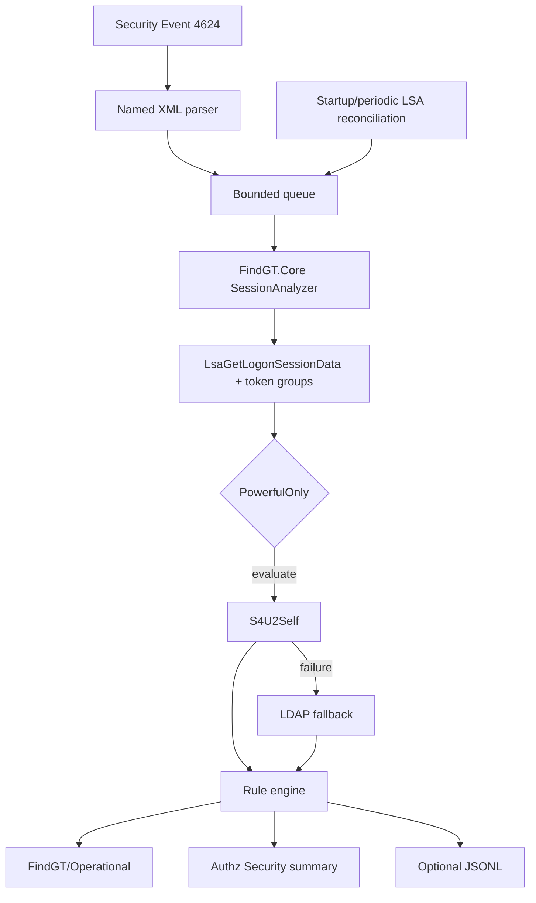

# Архитектура FindGT Service

## Граница ответственности

`FindGT.Service.exe` — отдельный x64 host на .NET Framework 4.8. SCM запускает
его как LocalSystem. Служба не ищет `winlogon.exe`, не дублирует чужой token и
не выполняет privilege escalation. Legacy impersonation сохранён только в CLI.

## Проекты

- `FindGT.Core` владеет native handles, LSA/SSPI, membership providers,
  PowerfulOnly, rule engine и typed result.
- `FindGT.Eventing` владеет 4624 ingestion, bookmark, queue/dedupe и sinks.
- `FindGT.Service` владеет lifecycle, config, workers, retry, reconciliation и
  health.
- `FindGT.EventMessages` содержит manifest/message resources.
- `FindGT.SetupActions` содержит минимальные native MSI custom actions.

## Startup

1. Загрузить и валидировать config; при ошибке использовать безопасные defaults.
2. Загрузить bookmark.
3. Запустить supervisor workers.
4. Открыть Security/4624 subscription.
5. Асинхронно запланировать startup LSA snapshot и enqueue неизвестных full LUID.
6. Запустить reconciliation timer.
7. Записать `ServiceStarted`.

Такой порядок закрывает окно между подпиской и startup snapshot.

## Processing

Ключ сессии: `MachineId + BootInstanceId + Full64BitLuid`. Callback watcher-а
не выполняет LSA, S4U, LDAP или disk I/O. Worker подтверждает session через LSA,
проверяет policy, получает token groups с attributes, строит authoritative
reference и запускает rules.

`Clean` возможен только при успешном authoritative reference. Отказ S4U и LDAP
даёт `Unknown`. Policy skip даёт `NotEvaluated`, а internal invariant failure —
`Error`.

## Shutdown

Служба отключает watcher, останавливает timer, отменяет workers, закрывает
bounded queue, ждёт bounded timeout, записывает `ServiceStopped` и освобождает
LSA/SSPI/Authz/event-provider handles.

## Trust и sensitive data

В events не помещаются ticket/PAC bytes, credentials, hashes, machine secrets,
session keys или raw SSPI buffers. Operational payload ограничен по размеру;
при сокращении устанавливается `PayloadTruncated=true`.
